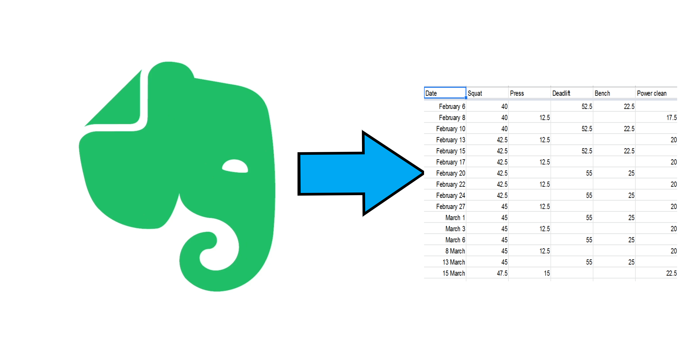

# Evernote_strength_scraper

A scraper which extracts my lifting data (via html) into an csv file. 


## Getting Started

These instructions will get you a copy of the project up and running on your local machine for development and testing purposes.

### Prerequisites

This project uses the BeautifulSoup library and pandas


Anaconda Enviroment
```
conda install -c anaconda beautifulsoup4 
conda install pandas
```

Normal enviroment

```
pip install beautifulsoup4
pip install pandas
```


### Installing

Using the example of an anacoda set up to make the enviroment

Call on conda create env to create you enviroment

```
conda create --name myenv
```
after you proced with yes, you must activate/switch into the new enviroment you just made.

```
conda activate myenv
```

Now you must install the third party packages that allow this program to run.

See the Prerequisites section above  

### Formating your file
TO DO


### Importing your file
Your file must be html file. Please use the evernote export function
PLACE IMAGE HERE

Replace the file path in the file varible 

```python

file = open("Starting strength log2.html", encoding="utf8")

REPLACE LIKE BELOW

file = open("YOUR_FILE.html", encoding="utf8")

```

For the cleaner.py to function you must import your non-clean csv file produced form main.py.
To do so replace the file path on the pd.read_csv function

```python
df = pd.read_csv('Lifts_edited.csv')
```


### Exporting
When collecting the non-clean csv file, replace the file name with your own:

```python 
with open('lifts2.csv', mode='w', encoding='utf-8') as lifts_file:
```

When exporting the clean csv file replace the file path in the df.to_csv function:
Found in the cleaner.py file

```python
df.to_csv('lifts_clean2.csv', index=False, encoding='utf-8')
```
